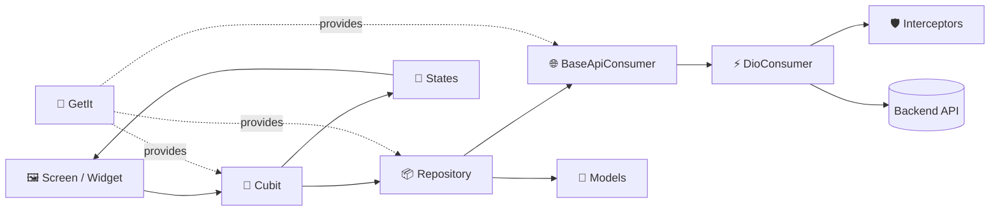
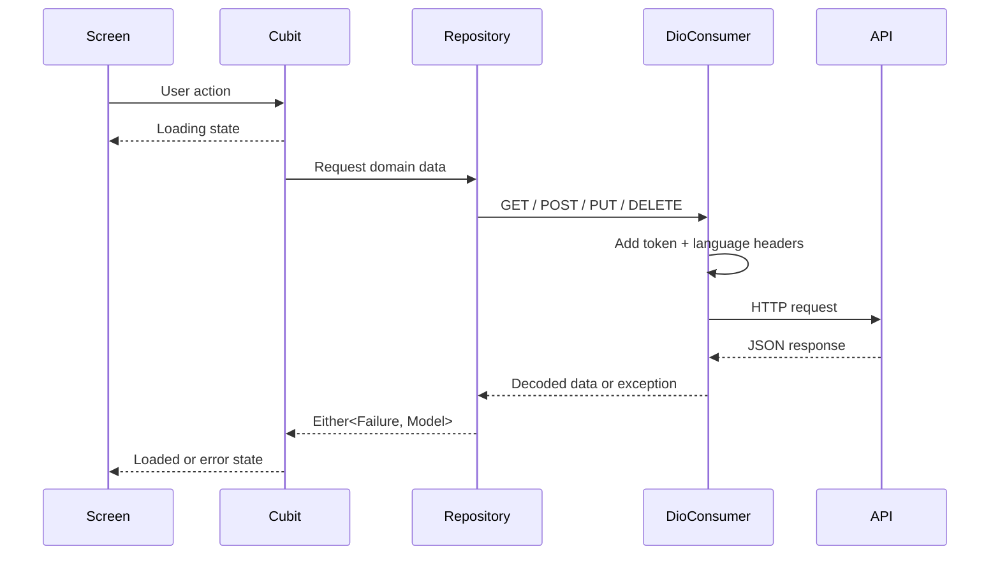
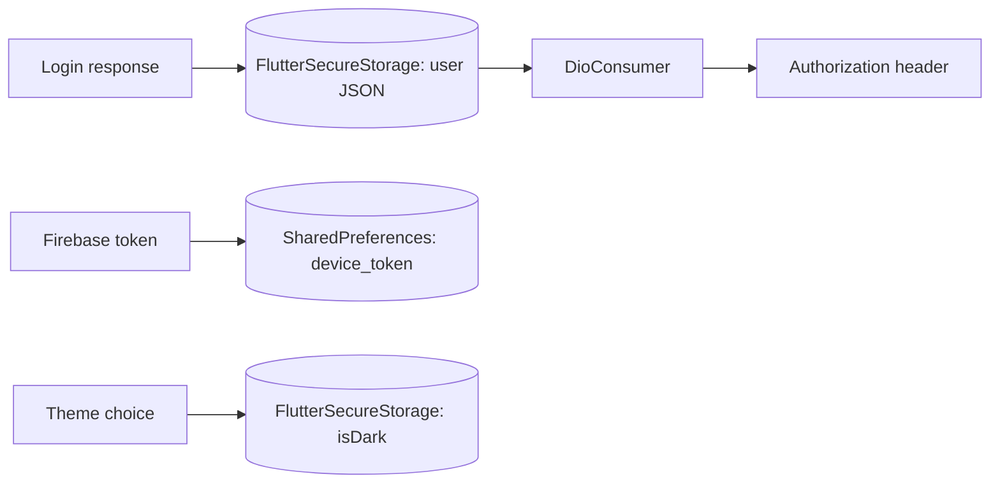

<div align="center">
  
  <h1>Flutter Structure 2026</h1>
  <p>A practical, feature-first Flutter starter for scalable, localized, API-driven applications.</p>

  
  
  
  
</div>

> This README describes the code as it currently exists. Sections marked **Demo/scaffold** need to be connected or configured before production use.

## 📚 Contents

- [What is included](#-what-is-included)
- [Project status](#-project-status)
- [Architecture](#-architecture)
- [Project structure](#-project-structure)
- [Technology stack](#-technology-stack)
- [Getting started](#-getting-started)
- [Branding and launcher icons](#-branding-and-launcher-icons)
- [API reference](#-api-reference)
- [Authentication and token storage](#-authentication-and-token-storage)
- [Notifications](#-notifications)
- [Localization and themes](#-localization-and-themes)
- [Testing](#-testing)
- [Adding a new feature](#-adding-a-new-feature)
- [Production checklist](#-production-checklist)

## ✨ What is included

| Area | Implementation |
|---|---|
| 🧱 Architecture | Feature-first folders with screens, Cubits, states, repositories, and models |
| 🔄 State management | `flutter_bloc` Cubits and a global `BlocObserver` |
| 💉 Dependency injection | `get_it` factories and lazy singletons |
| 🌐 Networking | Dio consumer with GET, POST, PUT, DELETE, interceptors, timeouts, logging, JSON decoding, and error mapping |
| 🔐 Persistence | `flutter_secure_storage` for user/session data and `shared_preferences` for lightweight preferences |
| 🔔 Notifications | Firebase Cloud Messaging scaffold plus foreground local notifications |
| 🌍 Localization | Arabic and English using `easy_localization`; Arabic is the initial/fallback locale |
| 🎨 Theming | Light/dark themes with a persisted theme choice |
| 📱 Responsive UI | `flutter_screenutil`, width-aware layouts, and reusable widgets |
| 🧭 Navigation | Central named routes with animated page transitions |
| 📶 Connectivity | Initial connection check and connectivity change stream |
| 🛍️ Demo feature | Product catalog, category filters, staggered grid, horizontal list, details sheet, loading/error/retry states |
| 🔑 Auth UI | Login form, validation, password visibility, and forgot-password email/OTP/reset screens |
| 🎞️ Splash | Lottie splash animation and external portfolio link |
| 🧭 Onboarding | Three responsive photographic pages, localized product copy, completion persistence, and a Hero transition into login |
| 🎯 App icons | One-source launcher-icon generation for Android, iOS, Web, Windows, and macOS |
| 🗂️ Device services | Image/file picking, sharing, phone/email/WhatsApp/browser/maps launchers, and image viewing |
| ☁️ Uploads | S3-compatible/DigitalOcean Spaces upload helper using AWS Signature V4 |
| 🧪 Tests | Widget tests for the login screen and long Arabic button text |

## 🚦 Project status

Knowing what is wired and what is only an example prevents future developers from treating demo behavior as production behavior.

| Feature | Status | Notes |
|---|---|---|
| Splash routing | ✅ Working | Checks onboarding completion after the 8.5-second splash delay |
| Portfolio link | ✅ Working | Opens an external browser |
| Product catalog | ✅ Working demo | Reads products from Fake Store API |
| Language switching | ✅ Working | Arabic/English; restarts the widget tree after switching |
| Theme switching | ✅ Working | Choice is stored securely |
| Login UI | 🧪 Demo/scaffold | Simulates success; it does **not** call `LoginRepo` yet |
| Login repository | 🧩 Available | POST request and model parsing are implemented |
| Forgot-password UI/Cubit | 🧪 Demo/scaffold | Cubit currently simulates success with delays |
| Forgot-password repository | 🧩 Available | Endpoints exist, with local fallback behavior; connect the Cubit before production |
| Firebase Messaging | ⚙️ Configuration required | Firebase option values are blank, so initialization is intentionally skipped |
| Local notifications | 🧩 Initialized | Notification channel identifiers are placeholders and tap navigation is not connected |
| Onboarding | ✅ Working | Three pages, named route, Arabic/English content, Skip/Get Started persistence, and Hero logo transition to login |
| Launcher icons | ✅ Configured | Uses `assets/images/app_icon.png` for Android, iOS, Web, Windows, and macOS |
| API tests | ⚠️ Not included | Add repository and integration tests for your real backend |

## 🏗️ Architecture

The project uses a lightweight layered, feature-first design:



Typical request flow:



### Responsibilities

- **Screen/widget:** rendering, input, and user interaction.
- **Cubit/state:** UI state and orchestration.
- **Repository:** data-source calls and mapping exceptions to failures.
- **Model:** request/response serialization.
- **BaseApiConsumer:** transport-independent HTTP contract.
- **DioConsumer:** Dio configuration, headers, JSON parsing, and network errors.
- **GetIt:** object creation and dependency lifetime.

## 🗂️ Project structure

```text
lib/
├── main.dart                         # Application entry point
├── app.dart                          # Root providers, localization, theme, routes
├── injector.dart                     # GetIt registrations
├── firebase_options.dart             # Firebase platform options (currently blank)
├── config/
│   ├── routes/                       # Named routes and transitions
│   └── themes/                       # Light/dark themes and ThemeCubit
├── core/
│   ├── api/                          # Dio, endpoints, interceptors, status codes
│   ├── error/                        # Exceptions and failures
│   ├── init_config/                  # Startup initialization
│   ├── models/                       # Shared models
│   ├── notification_services/        # FCM and local notifications
│   ├── preferences/                  # Secure storage and SharedPreferences
│   ├── services/                     # Picker, share, URL, permission helpers
│   ├── shared/                       # Shared APIs/controllers
│   ├── utils/                        # Constants, colors, translations, extensions
│   └── widgets/                      # Reusable UI components
└── features/
    ├── splash/                       # Animated startup screen
    ├── on_boarding/                  # Three-page localized onboarding flow
    ├── login/                        # Login UI, Cubit, repository, model
    ├── forget_password/              # Email → OTP → reset flow
    └── main_screen/                  # Product catalog demo

assets/
├── fonts/                            # Alexandria font family (100–900)
├── icons/                            # SVG icons
├── images/                           # App icon, onboarding photos, images, and Lottie JSON
└── lang/                             # ar.json and en.json
```

## 🧰 Technology stack

The validated local toolchain is:

- Flutter `3.41.9` (stable)
- Dart `3.11.5`
- DevTools `2.54.2`
- Project SDK constraint: `^3.11.5`
- Android Java/Kotlin target: Java `17`
- iOS deployment target: `15.0`

Key packages are grouped below. Check `pubspec.yaml` for exact versions.

| Purpose | Packages |
|---|---|
| State and DI | `flutter_bloc`, `equatable`, `get_it`, `dartz` |
| Networking | `dio`, `pretty_dio_logger`, `http`, `connectivity_plus` |
| Persistence | `flutter_secure_storage`, `shared_preferences` |
| Firebase/notifications | `firebase_core`, `firebase_messaging`, `flutter_local_notifications` |
| Localization/responsiveness | `easy_localization`, `flutter_screenutil`, `auto_size_text`, `intl` |
| Navigation | Flutter named routes, `page_transition`, `get` |
| Media/UI | `lottie`, `flutter_svg`, `cached_network_image`, `photo_view`, `image_picker`, `file_picker`, `pinput`, `flutter_staggered_grid_view` |
| Device integration | `permission_handler`, `url_launcher`, `share_plus`, `path_provider` |
| Feedback/loading | `cherry_toast`, `flutter_overlay_loader`, `overlay_loader_with_app_icon` |
| Branding/tooling | `flutter_launcher_icons` |

## 🚀 Getting started

### Prerequisites

Install Flutter stable and verify your environment:

```bash
flutter --version
flutter doctor -v
```

### Install and run

```bash
git clone <repository-url>
cd flutter-structure-2026
flutter pub get
flutter run
```

Choose a target explicitly when needed:

```bash
flutter devices
flutter run -d <device-id>
```

For iOS, install pods after fetching Dart packages:

```bash
cd ios
pod install
cd ..
flutter run
```

### Rename before starting a real app

Replace these template values:

- Package name: `new_strucuture` (the spelling is inherited throughout Dart imports).
- Android namespace/application ID: `net.elsapagh.flutter`.
- iOS bundle identifier and display name in the Xcode project.
- App title, icon, splash animation, colors, translations, API URL, and notification channel.
- Debug signing configuration in `android/app/build.gradle` with a release keystore.

## 🎯 Branding and launcher icons

The launcher-icon configuration lives directly in `pubspec.yaml` and uses one source image:

```text
assets/images/app_icon.png
```

The source is a 512×512 RGB PNG. Icon generation is enabled for Android, iOS, Web, Windows, and macOS. Android uses the `launcher_icon` resource name, iOS removes the alpha channel, and the Web theme/background colors follow the application palette.

Regenerate every configured platform icon after replacing the source image:

```bash
flutter pub get
dart run flutter_launcher_icons -f pubspec.yaml
```

`flutter_launcher_icons` does not generate Linux desktop icons; configure Linux icons manually in the runner/package metadata.

## 🌐 API reference

### Current endpoints

| Method | URL/path | Used by | State |
|---|---|---|---|
| `POST` | `https://elsapaghtest.net/api/auth/login` | `LoginRepo.login` | Repository exists; UI is not connected |
| `GET` | `https://elsapaghtest.net/api/home` | Endpoint constant only | Not currently called |
| `POST` | `https://elsapaghtest.net/api/auth/forgot-password` | `ForgetPasswordRepo.sendCode` | Repository exists; Cubit is simulated |
| `POST` | `https://elsapaghtest.net/api/auth/verify-code` | `ForgetPasswordRepo.verifyCode` | Repository exists; Cubit is simulated |
| `POST` | `https://elsapaghtest.net/api/auth/reset-password` | `ForgetPasswordRepo.resetPassword` | Repository exists; Cubit is simulated |
| `GET` | `https://fakestoreapi.com/products` | `MainRepo.getProducts` | Active demo endpoint |
| `PUT` | S3-compatible object URL | `UploadImagesToS3Api.uploadFiles` | Helper available; requires secure server-issued credentials |

Keep new application endpoints in `lib/core/api/end_points.dart`. Avoid defining feature URLs inline.

### Request behavior

`DioConsumer` currently configures:

- 1-minute connect, send, and receive timeouts.
- Plain-text responses followed by `jsonDecode`.
- JSON content type through `AppInterceptors`.
- `Authorization`, `Accept-Language`, `Accept`, and keep-alive headers.
- Pretty request/response logging in debug mode.
- Error mapping for 400, 401, 403, 404, 409, 500, timeouts, and no connection.
- Automatic stored-user removal and splash navigation after unauthorized responses.
- Optional form-data bodies and query parameters.

> **Authorization contract:** the current client sends the stored `accessToken` directly as the `Authorization` value. If your backend expects `Bearer <token>`, update `_getOptions()` in `dio_consumer.dart`.

### Adding an endpoint

```dart
// lib/core/api/end_points.dart
static const String profileUrl = '${baseUrl}profile';
```

```dart
class ProfileRepo {
  ProfileRepo(this.api);
  final BaseApiConsumer api;

  Future<Either<Failure, ProfileModel>> getProfile() async {
    try {
      final response = await api.get(EndPoints.profileUrl);
      return Right(ProfileModel.fromJson(response));
    } on ServerException {
      return Left(ServerFailure());
    }
  }
}
```

Register the repository/Cubit in `lib/injector.dart`, provide the Cubit in `lib/app.dart`, and add repository plus Cubit tests.

### Manual API smoke tests

Use non-production test accounts and never commit real tokens:

```bash
curl --request POST \
  --url 'https://elsapaghtest.net/api/auth/login' \
  --header 'Content-Type: application/json' \
  --data '{"phone":"<test-phone>","phone_code":"<code>","name":"<name>"}'
```

```bash
curl --request GET \
  --url 'https://fakestoreapi.com/products' \
  --header 'Accept: application/json'
```

For automated API coverage, mock `BaseApiConsumer` in repository unit tests. Use a staging server—not production—for integration tests.

## 🔐 Authentication and token storage

There are two storage helpers:

### `Preferences`

- Stores the serialized `LoginModel` under `user` in `FlutterSecureStorage`.
- Reads `data.accessToken` for authenticated Dio requests.
- Deletes the stored user on logout/unauthorized responses.
- Stores selected language and the FCM device token in `SharedPreferences`.

### `MySecureStorage`

Provides typed helpers for user ID, name, phone, role, access token, device token, language, notification preference, dark mode, grid mode, and tutorial flags. It also provides profile/session clearing helpers.



> `SharedPreferences` is not encrypted. If the FCM token is considered sensitive in your threat model, store it with `MySecureStorage.setDeviceToken()` instead. Keep one canonical token-storage approach to prevent inconsistent session state.

## 🔔 Notifications

`NotificationService` is initialized during app startup and supports:

- Firebase permission requests.
- FCM token retrieval and persistence.
- Messages that open a terminated app (`getInitialMessage`).
- Background message callback registration.
- Notification taps while the app is in the background.
- Foreground FCM messages displayed as local notifications.
- JSON notification payload parsing.
- A `MessageStateManager` helper for suppressing notifications in an active chat room.

### Firebase setup

The checked-in `firebase_options.dart` contains empty values. Until configured, startup logs a message and safely skips Firebase/FCM initialization; local-notification initialization still runs.

Configure Firebase for the target platforms:

```bash
dart pub global activate flutterfire_cli
flutterfire configure
```

Then verify:

- Android Firebase configuration and notification permission/manifest setup.
- iOS Push Notifications capability, Background Modes → Remote notifications, and APNs key/certificate in Firebase.
- Real channel ID, name, and description in `notification_service.dart`.
- Notification-tap routing for every supported payload type.
- Token refresh handling with `FirebaseMessaging.instance.onTokenRefresh`.
- Foreground, background, and terminated behavior on physical Android/iOS devices.

## 🌍 Localization and themes

Translations live in:

- `assets/lang/ar.json`
- `assets/lang/en.json`

Use keys in widgets:

```dart
Text('welcome_back'.tr())
```

When adding a key, add it to **both** locale files. The app starts in Arabic and supports Arabic and English. The main screen provides a language toggle.

Theme files live under `lib/config/themes/`. `ThemeCubit` switches between light and dark mode and persists the choice using secure storage. Use `ThemeHelper.colorsOf(context)` rather than hard-coded colors in feature UI when a semantic theme color exists.

The Alexandria font family is bundled at weights 100–900.

## 🧪 Testing

Run formatting, static analysis, and tests before every merge:

```bash
dart format --output=none --set-exit-if-changed lib test
flutter analyze
flutter test
```

Current widget tests cover:

- Login screen construction and expected form controls.
- Long Arabic button text at a narrow viewport without overflow.

Current validation baseline:

- `flutter test`: **2 tests passing**.
- `flutter analyze`: **2 findings**, both async `BuildContext` notices in the splash screen. The onboarding and login modules analyze cleanly. Resolve the splash notices before enforcing a zero-warning CI gate.

Recommended next tests:

- Cubit state sequences for products, login, and password reset.
- Repository success/error mapping with a fake `BaseApiConsumer`.
- Model JSON serialization/deserialization.
- Token attachment and 401 session-clearing behavior.
- Arabic/English and light/dark golden tests.
- Notification payload parsing and navigation.
- End-to-end login → main → logout flow against staging.

Suggested test layout:

```text
test/
├── core/
│   ├── api/
│   └── preferences/
├── features/
│   └── <feature>/
│       ├── cubit/
│       ├── data/
│       └── screens/
└── helpers/
```

## ➕ Adding a new feature

1. Create `lib/features/<feature_name>/`.
2. Add `data/model`, repository, `cubit`, state, `screens`, and optional `widget` folders.
3. Add endpoint constants to `EndPoints`.
4. Use `BaseApiConsumer` in the repository and return `Either<Failure, T>`.
5. Keep UI state inside the Cubit and emit explicit initial/loading/success/error states.
6. Register the repository and Cubit in `injector.dart`.
7. Provide the Cubit at the smallest appropriate widget scope (or in `app.dart` if truly global).
8. Add the route in `app_routes.dart`.
9. Add Arabic and English translation keys.
10. Add unit/widget tests and update this README if the public architecture or API changes.

## ⚠️ Production checklist

Complete these items before releasing an application built from this structure:

- [ ] Replace the template package/app identifiers and metadata.
- [ ] Move the API base URL to environment/flavor configuration.
- [ ] Connect login and forgot-password Cubits to their repositories.
- [ ] Remove demo success fallbacks from password-reset repositories.
- [ ] Configure Firebase and test notifications on physical devices.
- [ ] Implement FCM token refresh and server registration/removal.
- [ ] Replace placeholder notification channel values and wire tap routing.
- [ ] Remove the TLS `badCertificateCallback` that accepts every certificate.
- [ ] Rotate the object-storage credentials currently present in source control.
- [ ] Never ship storage access/secret keys in a client app; request short-lived signed upload URLs from your backend.
- [ ] Stop logging authentication tokens, credentials, request bodies, and sensitive responses.
- [ ] Decide on one canonical secure user/token storage API.
- [ ] Confirm whether the backend requires the `Bearer` authorization scheme.
- [ ] Replace Android debug signing with a protected release signing setup.
- [ ] Add privacy descriptions and platform permissions for every enabled device feature.
- [ ] Add unit, integration, and end-to-end coverage for real application flows.
- [ ] Add CI checks for formatting, analysis, tests, and release builds.
- [ ] Review dependency versions and licenses.

## 🛠️ Useful commands

```bash
# Dependencies
flutter pub get
flutter pub outdated

# Quality
dart format lib test
flutter analyze
flutter test --coverage

# Run/build
flutter run
flutter build apk --release
flutter build appbundle --release
flutter build ios --release
flutter build web --release

# Regenerate launcher icons
dart run flutter_launcher_icons -f pubspec.yaml
```

## 🤝 Maintenance rules

Repository-wide instructions for coding agents live in [`AGENTS.md`](AGENTS.md). Claude Code loads the same guidance through [`CLAUDE.md`](CLAUDE.md); personal `CLAUDE.local.md` overrides remain untracked.

- Keep feature-specific code inside its feature.
- Keep reusable code in `core` only after it is genuinely shared.
- Do not call Dio directly from widgets or Cubits; use repositories.
- Do not commit passwords, signing files, API secrets, or production tokens.
- Document every new endpoint and required environment variable.
- Update both locale files together.
- Keep the analyzer clean and add tests with every behavior change.

## 👤 Portfolio

Created as a reusable Flutter foundation by [Ahmed El Sapagh](https://elsapagh.octopusteam.net/).
